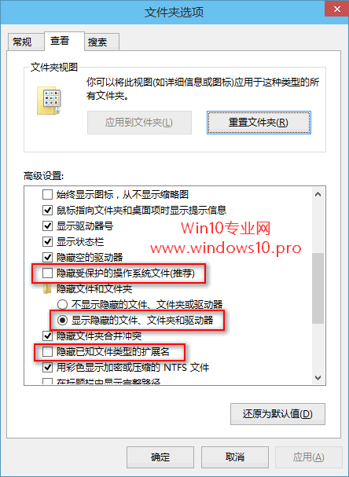
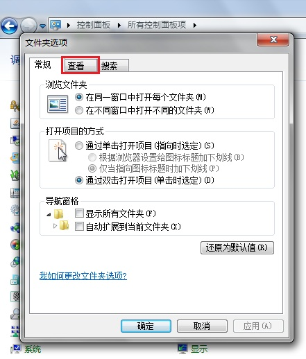
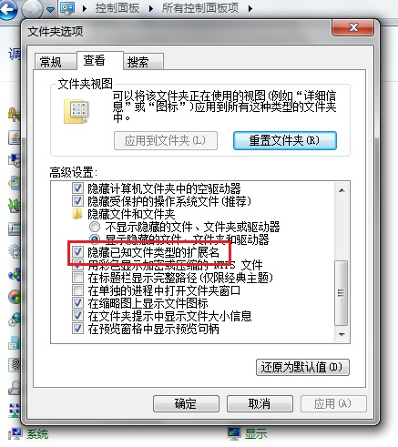
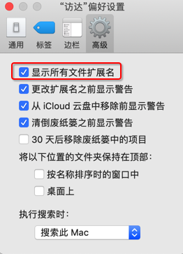
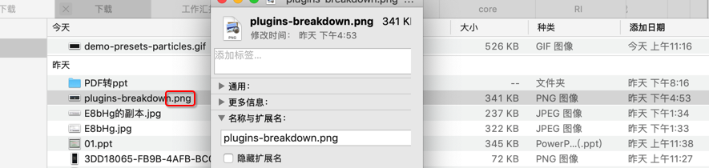
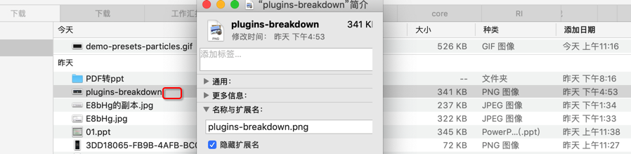

# 显示文件后缀名

关于如何设置去`显示文件后缀名`：

* Windows
  * Win10
    * 文字：`资源管理器`->`查看`->勾选 或 取消勾选 `文件扩展名`
    * 截图
      * 
    * 进一步
      * 想要显示被隐藏的操作系统文件
        * 文字
          * 勾选`文件扩展名`和`隐藏的项目`即可显示文件扩展名和普通的隐藏文件、文件夹或驱动器
          * 但是还不能显示被隐藏的操作系统文件
          * 点击`选项`图标打开`文件夹选项`窗口，切换到`查看`选项卡
          * 在下面的`高级设置`中取消勾选`隐藏受保护的操作系统文件`
          * 同时你会发现刚才所做的勾选`文件扩展名`和`隐藏的项目`的操作在这里同样可以通过选中`显示隐藏的文件、文件夹或驱动器`和取消勾选`隐藏已经文件类型的扩展名`来实现。
        * 截图：
          * 
  * Win7
    * 文字
        * `控制面板`->`文件夹选项`->`查看`->`高级设置`->`隐藏已知文件类型的扩展名`
    * 截图
      * 
      * 
      * 
* Mac
  * 如何设置是否显示文件名后缀
    * 文字：访达`Finder`->`偏好设置`->`高级`->勾选 或 取消勾选 `显示所有文件扩展名`
    * 截图：
        * 
        * 
  * 举例
    * 某png图片是否显示文件后缀名
      * 显示
        * 
      * 不显示
        * 
      * 另外
        * 请注意此处 种类是：`PNG图像`
          * 表示是后缀是`.png`的图像文件=照片
    * 更多解释
      * 在 Mac 上显示或隐藏文件扩展名 - Apple 支持
        * https://support.apple.com/zh-cn/guide/mac-help/mchlp2304/10.14/mac/10.14
