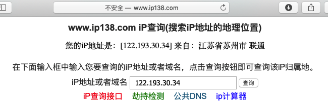
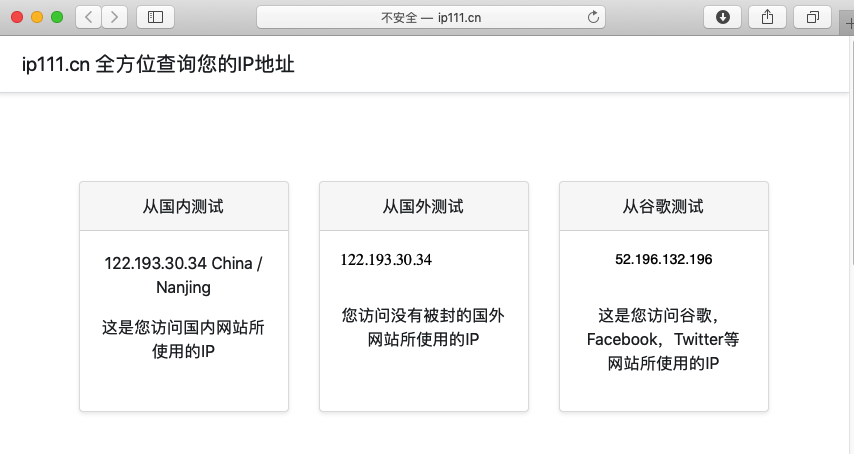
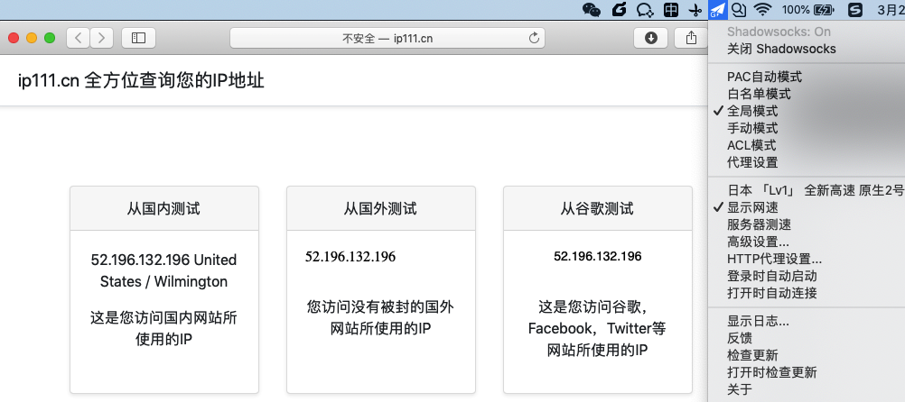

# IP地址

## IP查询

当想要知道一个IP地址，对应着什么城市地区的话，可以用在线网站去查询IP。

举例：

[IP地址查询](http://www.ip138.com)

查询结果：

> 您的iP地址是：\[122.193.30.34\] 来自：江苏省苏州市 联通

另外还有一个更好的查询IP的网站，支持查询自己翻墙的IP地址

[显示查询自己的IP地址](http://ip111.cn)

http://ip111.cn

* 查询结果举例：
  * 没开代理
    * 
  * 开了全局代理
    * 
