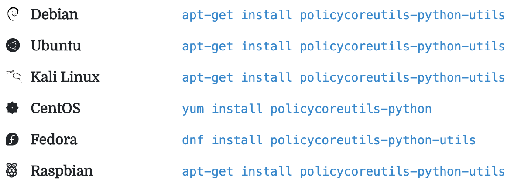

# 包管理器的心得

## 相同包不同系统名字略有不同

同一个工具和包，不同的系统中，名字往往不太一样，但往往是类似的规律

比如

某个库的开发的包的命令规律：

* `Ubuntu`
  * `libxxx-dev`
  * `apache2-dev`
* `CentOS`
  * `xxx-devel`

### 举例

#### openssl

`openssl`这个库，对应的（用于开发，被别人源码编译期间所需要的）开发包：

* `Ubuntu`（`Debian`，基于`Debian`的树莓派）：`libssl-dev`
  * 安装：`apt-get install libssl-dev`
* `CentOS`：`openssl-devel`
  * 安装：`yum install openssl-devel`

#### zeromq

[ZeroMQ | Download](https://zeromq.org/download/#osx)

* `CentOS7`
  * `yum install -y zeromq-devel`
* `Debian`/`Ubuntu`
  * `apt-get install libzmq3-dev`
* `Fedora`
  * `dnf install zeromq-devel`
* `Arch`
  * `pacman -S zeromq`
* `SUSE`
  * `zypper install zeromq-devel`

#### policycoreutils-python

* `Debian`：`apt-get install policycoreutils-python-utils`
* `Ubuntu`：`apt-get install policycoreutils-python-utils`
* `Kali Linux`：`apt-get install policycoreutils-python-utils`
* `CentOS`：`yum install policycoreutils-python`
* `Fedora`：`dnf install policycoreutils-python-utils`
* `Raspbian`：`apt-get install policycoreutils-python-utils`

