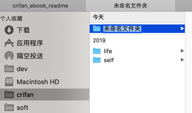
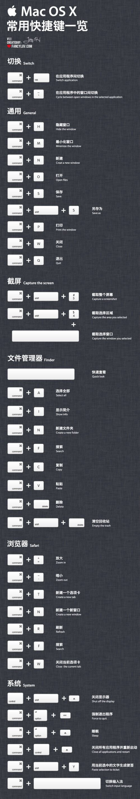

# Mac

此处整理Mac系统中各种通用知识和经验心得。

## 键盘

### 常用按键

| Mac按键 | 键盘上标识 | 缩写 | 对应Win中的 |
| ------ | -------- | ---- | --------- |
| `Command`键 | `⌘` | Cmd | `Windows` 键 |
| `Option`键 | `⌥` |      | Alt |
| `Caps Lock`键 | `⇪`   中/英 | | |
| `Shift`键 | `⇧` | | |
| `Control`键 | `⌃` | `Ctrl` | |
| `Fn`键 | `fn` | | |
| `delete`键 | `⌫` | `del` | |

### 常用快捷键

* `Command`+`Shift`+`N`：
  * `Finder`：新建空文件夹
    * 
* `Command+O`：打开所选项，或打开一个对话框以选择要打开的文件
  * 举例：
    * `Finder`：（先选中某文件后）打开文件
      * = 鼠标双击某文件
* `Command`+`↓`
  * `Finder`：（先选中某文件后）打开文件
    * = 鼠标双击某文件
* `Command+ ↑`
  * （从当前目录）回到上一级目录

### 快捷键

附上别人整理，相对比较全的，最常用的Mac快捷键：

注：其中有个笔误：

* `Command+Shift+N` 才是 `打开文件` 而不是 `Command+N`
