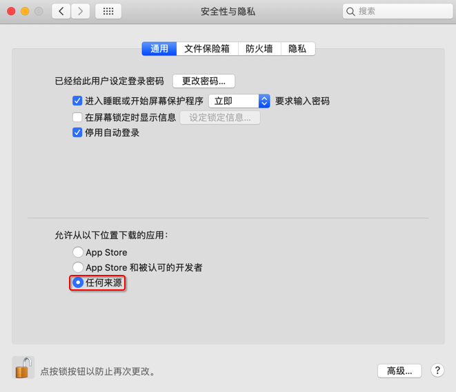
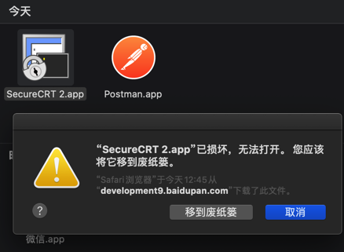

# app安全限制

Mac中默认安全限制很严格。


最常见的一个现象就是：

## 第一级：允许任何来源解决app已损坏，打不开。您应该将它移到废纸篓

对于很多未签名的，来源不明的，但其实往往是安全的app，默认是不允许安装的。

且还会提示`app已损坏，打不开。您应该将它移到废纸篓`

解决办法：

先去终端中

```bash
sudo spctl --master-disable
```

然后去：

`设置`->`安全与隐私`->`通用`->`允许从以下位置下载的app`->`任何来源`



### 第二级：设置不要被隔离

但是个别情况，此时还无法打开app，举例：



原因：`macOS 10.15+`系统对于未签名的应用又进一步收缩了权限

解决办法=规避办法=绕开办法：

```bash
sudo xattr -rd com.apple.quarantine /Applications/YourApplicationName.app
```

举例：

```bash
sudo xattr -rd com.apple.quarantine /Applications/SecureCRT\ 2.app
```

详见：

[【已解决】Mac的Catalina中已spctl操作过但还是：app已损坏，打不开。您应该将它移到废纸篓](http://www.crifan.com/mac_catalina_has_spctl_still_app_damaged_cannot_open_move_to_trash)
